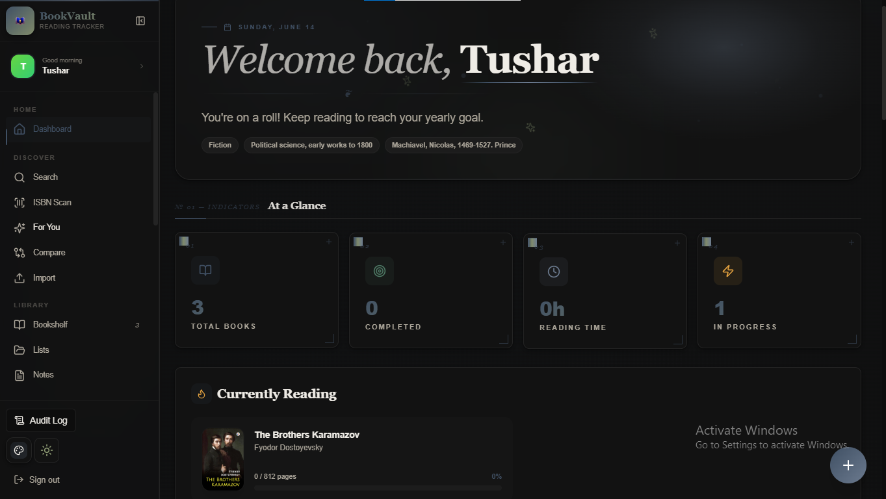
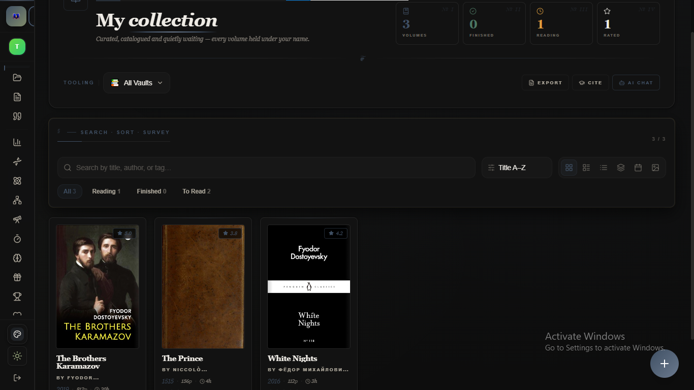
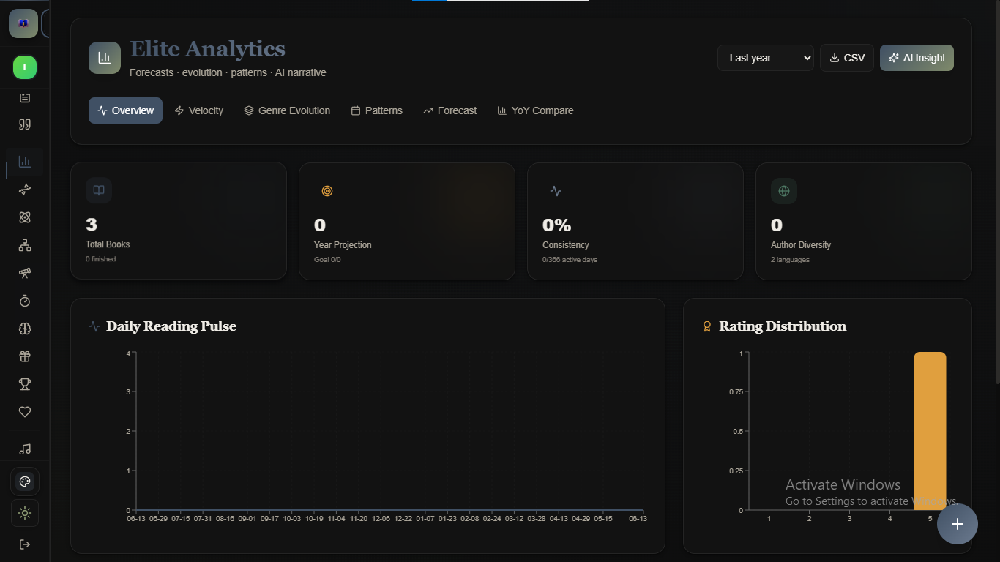

<h1 align="center">
  <!--  -->
  📚 BookVault
</h1>

<p align="center">
  <strong>Your Personal Reading Companion</strong>
</p>

<p align="center">
  Discover • Track • Analyze • Learn • Grow
</p>

<p align="center">
  <a href="https://bookvault2.netlify.app">
    
  </a>
  
  
  
 
  
</p>

---

> **BookVault isn't just a bookshelf.**
>
> It's a complete reading intelligence platform that helps readers discover books, build habits, track progress, analyze reading patterns, and receive personalized AI-powered recommendations.

---

# ✨ Why BookVault?

Most reading apps stop at tracking books.

BookVault goes further.

📖 Organize your personal library  
📈 Analyze reading habits  
🤖 Get AI-powered recommendations  
🎯 Track reading goals  
🏆 Build reading streaks  
📝 Save thoughts & notes  
📊 Visualize your growth as a reader

---

# 🎥 Product Showcase

## 🏠 Home Dashboard



---

## 📚 Personal Bookshelf



---

---

## 📊 Reading Analytics



---

# 🚀 Core Features

## 📚 Personal Library Management

Build your digital bookshelf.

### Features

- Add books instantly
- Search using Google Books API
- Organize collections
- Track reading status
- Save personal ratings
- Add private notes

### Reading Statuses

| Status | Description |
|----------|----------|
| 📖 Reading | Currently reading |
| ⏳ To Read | Planned books |
| ✅ Finished | Completed books |

---

## 🔍 Book Discovery Engine

Discover your next favorite book.

### Search By

- Title
- Author
- ISBN

### Powered By

- Google Books API

---

## 🤖 AI Book Assistant

Your personal literary companion.

### Ask Questions Like

> "Recommend books similar to Atomic Habits"

> "Summarize this book"

> "Analyze my reading habits"

> "What genre should I explore next?"

### AI Features

- Personalized recommendations
- Reading pattern analysis
- Book summaries
- Literary discussions

---

## 📈 Reading Analytics

Transform reading data into insights.

### Track

- Books completed
- Reading streaks
- Pages read
- Reading sessions
- Monthly progress
- Genre distribution

### Visualized With

- Interactive charts
- Progress dashboards
- Reading reports

---

## ⏱️ Reading Session Tracker

Stay accountable.

### Log

- Reading time
- Pages completed
- Daily sessions
- Progress updates

### Benefits

- Build consistency
- Maintain streaks
- Measure growth

---

## 📝 Smart Notes System

Capture every insight.

### Store

- Quotes
- Ideas
- Reflections
- Reviews

### Export Formats

- TXT
- Markdown
- JSON

---

## 🎨 Modern Experience

### User Experience

- Dark Mode
- Light Mode
- Responsive Design
- Smooth Animations
- Fast Navigation

---

# 🏗️ System Architecture

```text
User
  ↓
React Frontend
  ↓
React Query
  ↓
Supabase Backend
  ↓
Google Books API
  ↓
AI Assistant
```

---

# 🛠️ Tech Stack

## Frontend

- React
- TypeScript
- Vite

## UI

- Tailwind CSS
- shadcn/ui
- Radix UI

## Forms

- React Hook Form
- Zod

## State Management

- TanStack React Query

## Data Visualization

- Recharts

## Backend

- Supabase

## AI

- Gemini
- Supabase Edge Functions

---

# ⚡ Quick Start

## Clone Repository

```bash
git clone https://github.com/YOUR_USERNAME/bookvault.git

cd bookvault
```

## Install Dependencies

```bash
npm install
```

## Start Development Server

```bash
npm run dev
```

Application runs at:

```bash
http://localhost:5173
```

---

# 🌐 Live Demo

### Explore BookVault

https://bookvault2.netlify.app

---

# 🔮 Future Roadmap

## Reading Experience

- [x] Reading Challenges
- [ ] Community Reviews
- [ ] Book Clubs
- [ ] Reading Calendar

## AI Features

- [ ] Voice AI Assistant
- [ ] Personalized Learning Paths
- [ ] Smart Reading Plans

## Social Features

- [ ] Friend Activity
- [ ] Shared Bookshelves
- [ ] Community Recommendations

---

# 🤝 Contributing

Contributions are welcome.

```bash
git checkout -b feature/amazing-feature
git commit -m "Add amazing feature"
git push origin feature/amazing-feature
```

Create a Pull Request and let's build BookVault together.

---

# 📄 License

Licensed under the MIT License.

---

<p align="center">

## 📚 BookVault

Read Better. Think Deeper. Grow Smarter.

Built with ❤️ for readers.

</p>
````
